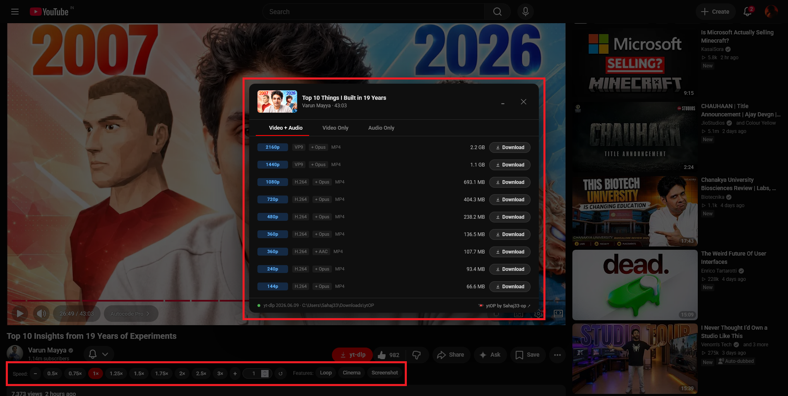
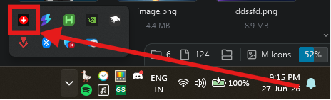

<div align="center">


<br/>

[](https://raw.githubusercontent.com/Sahaj33-op/YtOP/master/YouTube%20Enhanced%20Suite.user.js)

*⚠️ Note: This userscript requires the local Python bridge server running in the background to process downloads.*

<br/>


</div>

<div align="center">
  
</div>

A light-weight YouTube integration, plus a local download suite. ytOP helps smooth out that in between place, between browser comfort and raw CLI control, sorta bridging a lovely Tampermonkey userscript overlay with a multi-threaded Python backend server, run with yt-dlp and ffmpeg.

---

## 📖 Table of Contents
*   [Installation & Setup](#-installation--setup)
*   [Key Features](#-key-features)
*   [Architecture Flow](#%EF%B8%8F-architecture-flow)
*   [File Structure](#-file-structure)
*   [Configurations](#-configurations)
*   [Frequently Asked Questions (FAQ)](#-frequently-asked-questions-faq)
*   [Disclaimer](#-disclaimer)

---

## 🚀 Installation & Setup

### Prerequisites
*   [Python 3.x](https://www.python.org/)
*   A userscript manager extension (e.g., [Tampermonkey](https://www.tampermonkey.net/) or [Violentmonkey](https://violentmonkey.github.io/))
*   `yt-dlp` and `ffmpeg` installed. We recommend installing via WinGet:
    ```powershell
    winget install yt-dlp Gyan.FFmpeg
    ```
*   *(Optional)* `pystray` and `Pillow` to enable the system tray status icon:
    ```powershell
    pip install pystray Pillow
    ```

### Step 1: Clone the Repository
Clone this repository to your local machine to obtain the Python bridge server and runner scripts:
```bash
git clone https://github.com/Sahaj33-op/YtOP.git
cd YtOP
```

### Step 2: Install the Userscript
Click the prominent **Install Userscript** badge at the top of this page to install directly, or:
1. Open Tampermonkey in your browser and select **Create a new script**.
2. Replace the template code with the contents of **[YouTube Enhanced Suite.user.js](YouTube%20Enhanced%20Suite.user.js)**.
3. Save the script (`Ctrl + S`).

### Step 3: Run the Local Bridge Server
*   Double-click **[start-server.bat](start-server.bat)** to launch the console bridge.
*   *Alternatively*, run **[start-silent.vbs](start-silent.vbs)** to execute the server invisibly in the background.

---

## 🌟 Key Features

<details>
<summary>⚡ Click to expand Key Features list</summary>

<details style="margin-top: 10px; margin-left: 10px;">
<summary>🎮 Player Enhancement & Controls</summary>

*   **Speed Tuning**: Instant speed preset buttons (`0.5x` to `3x`) plus high-fidelity fine-tuning controls (`-` / `+` in steps of `0.25x`).
*   **Player Extras**: Native cinema mode overlay, A/B looping boundaries, and high-definition canvas screenshots.
*   **OSD (On-Screen Display)**: Sleek, non-intrusive micro-animations indicating status updates directly over the YouTube player.
</details>

<details style="margin-top: 10px; margin-left: 10px;">
<summary>📥 High-Speed Multi-Format Downloader</summary>

*   **Intelligent Formats Extraction**: Dynamic extraction of available media profiles directly inside watch and shorts pages.
*   **Tabbed Interface**: Clean separation for `Video + Audio` (muxed streams), `Video Only` (raw streams), and `Audio Only` (audios).
*   **Dynamic Extension Filters**: Filter profiles instantly via clickable format pills (e.g. `[MP4]`, `[WEBM]`, `[M4A]`, `[OPUS]`).
</details>

<details style="margin-top: 10px; margin-left: 10px;">
<summary>⚡ Live Progress & Background Execution</summary>

*   **Sleek Inline Progress Tracks**: A 3px horizontal red progress line glides along the format row during active downloads.
*   **Tooltips**: Hovering the button exposes real-time transfer speeds and ETA.
*   **Minimize to Background**: Click the minimize (`🗕`) button or press `M` to collapse the overlay into a compact, interactive floating card. Browse or watch other videos on YouTube while the download runs in the background.
*   **Self-Restoring State**: Click the minimized card to expand the modal back to its original state.
*   **Auto-Minimize on Close**: Hitting `Esc` or clicking outside the modal during active downloads auto-minimizes the window instead of destroying it.
</details>

<details style="margin-top: 10px; margin-left: 10px; margin-bottom: 10px;">
<summary>🛠 System Self-Healing & Diagnostics</summary>

*   **Auto-Resolution**: The Python backend checks system PATH and automatically resolves WinGet installation directories for `ffmpeg` and `yt-dlp` to ensure a zero-config start.
*   **Availability Warnings**: Startup verification checks. If FFmpeg is missing from the environment, a `(⚠️ FFmpeg missing)` warning is highlighted in the modal footer.
</details>

</details>

---

## ⚙️ Architecture Flow

<details>
<summary>🔗 Click to expand Architecture Diagram</summary>

```
+---------------------------------------------------------+
|                  YouTube Watch Page                     |
|                                                         |
|  [ Tampermonkey / Violentmonkey Userscript Overlay ]    |
|   - Interactive format lists & filter chips             |
|   - Minimize button, keyboard shortcuts, progress bar  |
+---------------------------+-----------------------------+
                            |
                 (POST /download, GET /progress)
                            |
                            v
+---------------------------------------------------------+
|             Local Python Bridge Server                  |
|                 (http://127.0.0.1:9898)                 |
|                                                         |
|  [ Multi-Threaded HTTP Server & Progress Manager ]      |
|   - Executable path self-resolution (WinGet path lookup)|
|   - Real-time stdout regex stream parsing               |
+---------------------------+-----------------------------+
                            |
                   (subprocess.Popen)
                            |
                            v
+---------------------------------------------------------+
|               System Binaries (CLI)                     |
|                                                         |
|        [ yt-dlp.exe ]  =======>  [ ffmpeg.exe ]         |
|      (Stream Fetcher)          (Format Muxer/Joiner)    |
+---------------------------------------------------------+
```

</details>

---

## 📁 File Structure

*   `YouTube Enhanced Suite.user.js` - Tampermonkey userscript containing the client UI and player controls.
*   `yt-dlp-server.py` - Multi-threaded Python server handling background subprocess spawning and progress reports.
*   `start-server.bat` - Standard console window startup script.
*   `start-silent.vbs` - Visual Basic script to launch the server silently.
*   `stop-server.bat` - Shell script to automatically search and terminate active server processes.
*   `.gitignore` - Pre-configured git rules to ignore caches and IDE configurations.

---

## 🛠 Configurations

You can modify the following variables inside **[yt-dlp-server.py](yt-dlp-server.py)**:
*   `PORT`: Port for the local bridge server (default: `9898`).
*   `DOWNLOAD_DIR`: Absolute path to save downloads (default: `%USERPROFILE%/Downloads/ytOP`).
*   `FFMPEG_BIN` / `YTDLP_BIN`: Customize absolute paths to the binaries if not using standard system installation paths.

---

## ❓ Frequently Asked Questions (FAQ)

<details style="margin-top: 10px;">
<summary><b>How do I start the server silently in the background?</b></summary>
<br/>

Instead of double-clicking `start-server.bat` (which leaves a Command Prompt window open), double-click **[start-silent.vbs](start-silent.vbs)**. This runs the Python server completely in the background.
</details>

<details style="margin-top: 10px;">
<summary><b>How do I stop the background server?</b></summary>
<br/>

To stop the silent background server, double-click **[stop-server.bat](stop-server.bat)** in this repository folder. It will find the running Python server process and terminate it immediately. Alternatively, if you have the optional system tray icon enabled, simply right-click the red tray icon and select **Stop Server**.
</details>

<details style="margin-top: 10px;">
<summary><b>How do I enable and use the system tray icon?</b></summary>
<br/>

If you install the optional tray dependencies (`pip install pystray Pillow`), a red download arrow icon will automatically appear in your Windows system tray when the server is running.
* Right-click the icon to quickly **Stop Server**, **Open Downloads Folder**, or open the **GitHub Repository**.
* If the libraries are not installed, the server will seamlessly run in standard console/background mode without crashing.

<br/>

<div align="center">
  
</div>
</details>

<details style="margin-top: 10px;">
<summary><b>How do I make the server start automatically when my computer boots?</b></summary>
<br/>

1. Press `Win + R` to open the Windows Run dialog.
2. Type `shell:startup` and press **Enter** (this opens your Windows Startup folder).
3. Right-click inside the folder, select **New ➔ Shortcut**.
4. Click **Browse...**, select **[start-silent.vbs](start-silent.vbs)**, and click **Finish**.
</details>

<details style="margin-top: 10px;">
<summary><b>Why do I see a <code>(⚠️ FFmpeg missing)</code> warning?</b></summary>
<br/>

The bridge server checked your PATH and standard folders but could not find a valid `ffmpeg.exe` installation. To resolve this:
* Make sure FFmpeg is installed (e.g. via `winget install Gyan.FFmpeg`).
* If already installed, open **[yt-dlp-server.py](yt-dlp-server.py)** and set `FFMPEG_BIN` to the absolute path of your executable (e.g. `r"C:\tools\ffmpeg\bin\ffmpeg.exe"`).
</details>

<details style="margin-top: 10px;">
<summary><b>Can I change where downloaded videos are saved?</b></summary>
<br/>

Yes. Open **[yt-dlp-server.py](yt-dlp-server.py)** and update the `DOWNLOAD_DIR` path to any directory of your choice.
</details>

<details style="margin-top: 10px; margin-bottom: 20px;">
<summary><b>Is it safe to run this server?</b></summary>
<br/>

Yes. The server binds strictly to `127.0.0.1` (localhost) and only handles requests from `https://www.youtube.com`. Other devices on your local network cannot connect or access your filesystem.
</details>

---

## ⚖️ Disclaimer

This software is for personal educational purposes only. Downloading copyrighted material from YouTube without authorization violates YouTube's Terms of Service. The developers are not responsible for any misuse of this tool.
